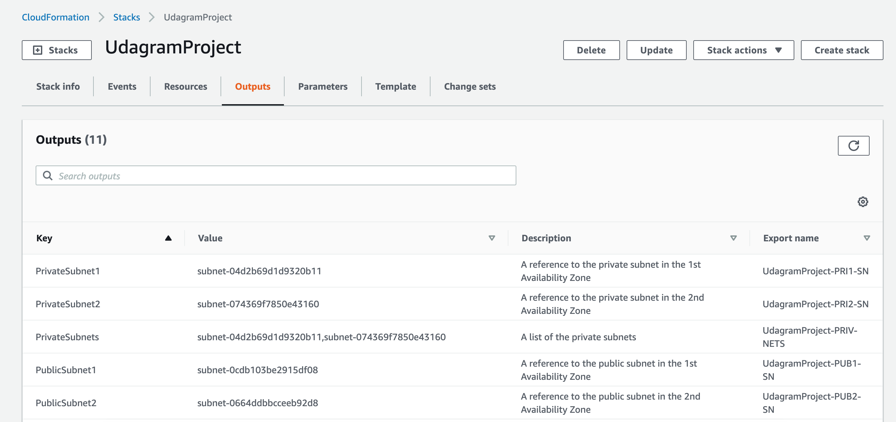

# Deploy a high-availability web app using CloudFormation


# Usuage:

Use below command to deploy the stack.

```
 ./create-stack.sh UdagramProject udagram-project.yml udagram-project-parameters.json
```

# Other installation [optional]

If you would like to deploy infra/network structure and servers separately, you can follow below commands.

Create network stack:

```
 ./create-stack.sh UdagramProjectNetwork udagram-network.yml udagram-network-parameters.json
```

Deploy server stack:

```
 ./create-stack.sh UdagramProjectServers udagram-servers.yml udagram-servers-parameters.json
```

# Results of Cloudformation script deployment

1. Creating stack


2. Stack in-progress status on the cloudformation dashboard


3. Stack Events


4. Stack Resources


5. Stack Outputs



6. Stack Parameters


7. Stack complete status


8. VPC


9. Subnets


10. Routing tables


11. Internet Gateways


12. NAT Gateways


13. Secutiry Groups


14. EC2 instances


15. Load Balancer


16. Target Groups


17. Launch Configuration


18. Auto Scaling Groups


19. S3 (index.html)


20. Working test (Clouformation stack Output)


21. Udagram website result


